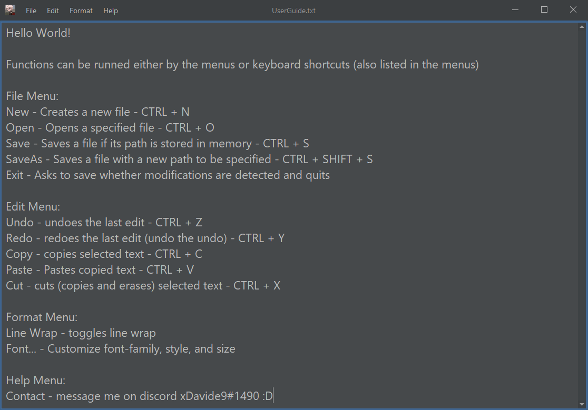

# BetterNotePad
Inspired by Windows notepad, but better because it is dark themed

### Features

- modern look thanks to flatlaf
- great package of functions (see user guide down below)
- entirely built in java 17 (jdk 17.0.1) and swing

### User Guide

- download java 17 or later
- reach me on discord at xDavide9#1490 for further help

> Author: xDavide9
