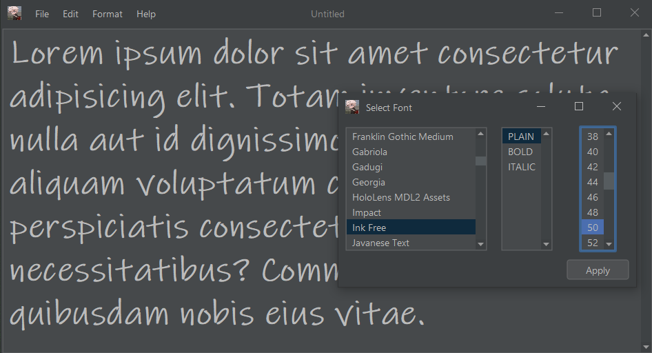
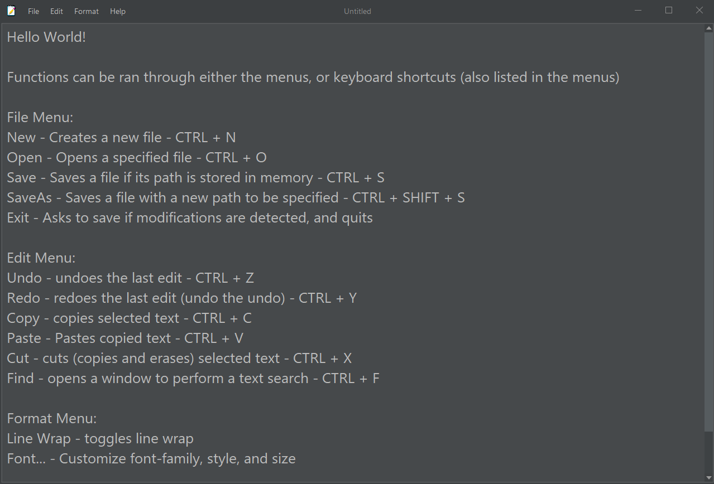

# JNotepad

> Inspired by Windows 10 Notepad, but dark-themed

### Installation
- For Windows, you can install [JNotepad.exe](https://github.com/woodrow73/JNotepad/releases) as a standalone application
- To run the [_Jar_](https://github.com/woodrow73/JNotepad/releases), make sure you have [_Java 17_](https://www.oracle.com/java/technologies/javase/jdk17-archive-downloads.html) or later installed
- You can run the application with `java -jar JNotepadFork-<<version>>.jar`

### Features

- Modern look thanks to [_Flatlaf_](https://www.formdev.com/flatlaf/#:~:text=FlatLaf%20is%20a%20modern%20open,on%20Java%208%20or%20newer.)
- Great package of functions
- Entirely built with _JDK 17.0.1_ using the _Swing API_

### User Guide

- Under each menu are function that control an aspect of the application
    - `File` allows to interact with the file system
    - `Edit` is useful when writing to save time
    - `Format` displays the text in a preferred way
    - `Help` links to both the original repository, and to this forked repository

### Credits

[Icon credits](https://www.freeiconspng.com/img/17522)  
[Laf credits](https://github.com/JFormDesigner/FlatLaf)

